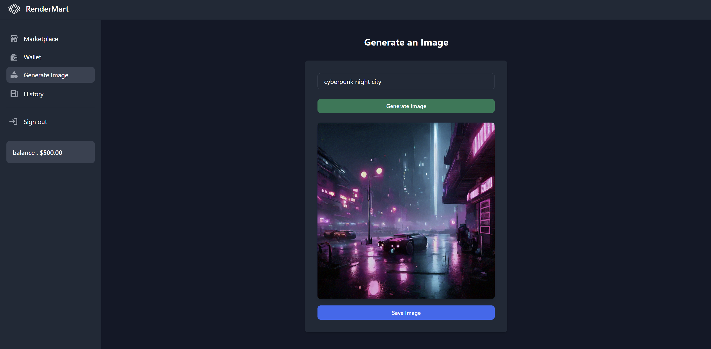
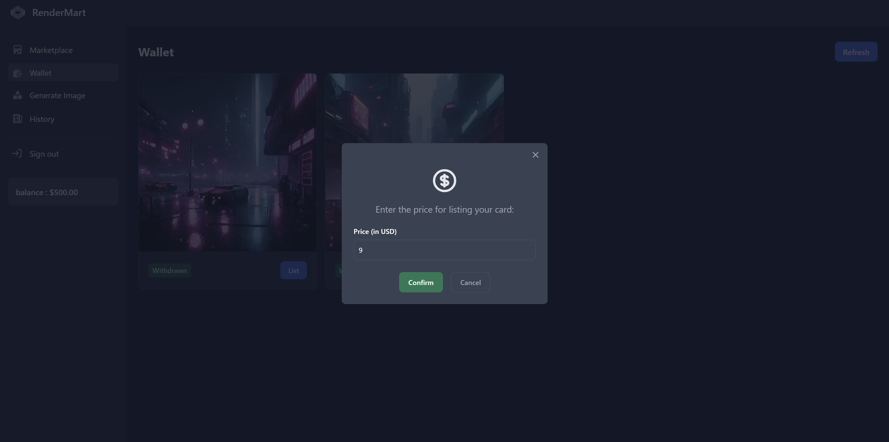
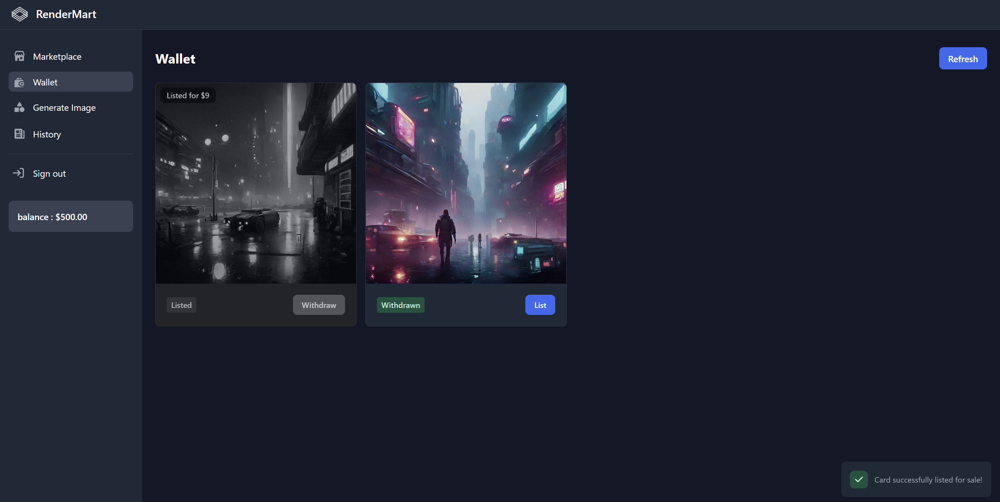
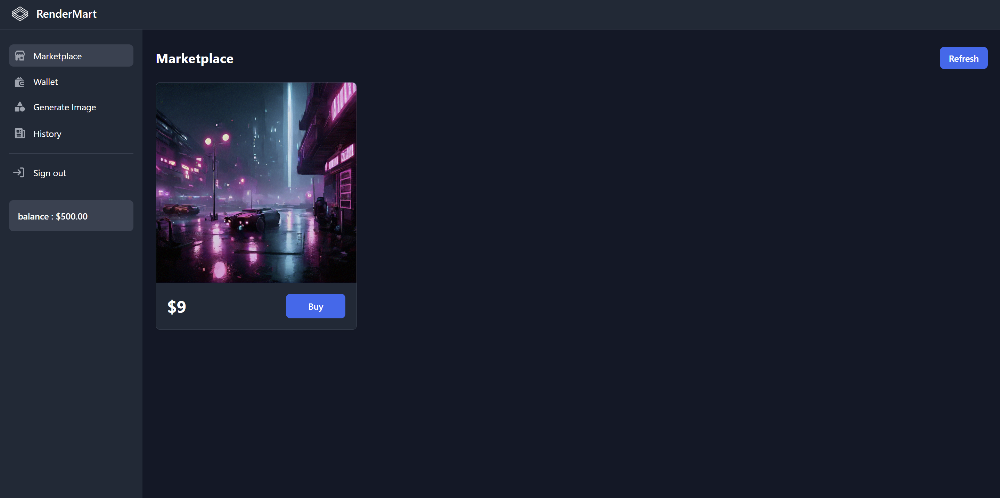
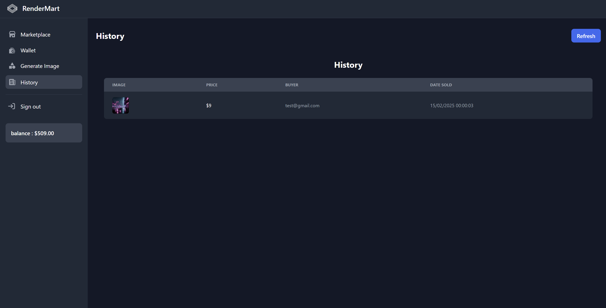

# 📸 RenderMart - User Interface

## 🎨 Image Generation  
Users can generate an image by entering a description and clicking **"Generate Image"**. Once created, the image can be saved.

---

## 🏦 Wallet Management  
Users can manage their generated images and list them for sale with a custom price.

📍 **Setting a price before listing an image**  

📍 **Image successfully listed on the marketplace**  

---

## 🛒 Marketplace  
Users can browse and purchase images listed for sale by other creators.

---

## 📜 Sales History  
Once an image is sold, it appears in the **Sales History**, showing the price, buyer, and date of sale.

---

This section provides a complete **user journey**, from **image generation** to **listing and selling on the marketplace**.
